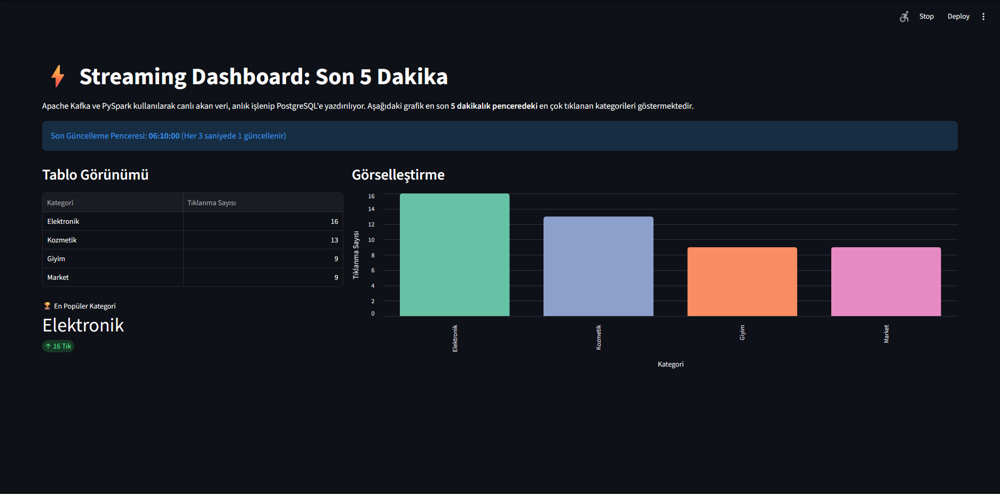
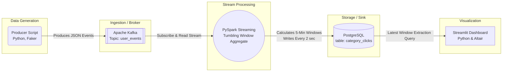

# Real-Time Big Data Pipeline 

[](https://python.org)
[](https://kafka.apache.org/)
[](https://spark.apache.org/)
[](https://www.postgresql.org/)
[](https://streamlit.io/)

[🇬🇧 English Version](#english-version) | [🇹🇷 Türkçe Versiyon](#turkce-versiyon)

---




<a id="turkce-versiyon"></a>
## 🇹🇷 Türkçe Açıklama

Bu proje, modern veri mühendisliği standartlarına uygun olarak tasarlanmış **uçtan uca (end-to-end)** yatay ölçeklenebilir bir gerçek zamanlı (real-time) veri işleme boru hattıdır (pipeline). 

Proje, e-ticaret platformlarındaki kullanıcı tıklama (click) verilerini simüle eden bir producer uygulamasından Streamlit tabanlı canlı izleme paneline kadar tüm süreci kapsamaktadır. 

###  Mimarimiz

Veri akışı şu şekilde tasarlanmıştır: `Producer` her saniye JSON metrikleri üretir ve `Kafka` kuyruğuna bırakır. `PySpark Structured Streaming`, bu yüksek hızlı veriyi anlık parçalara ayırıp pencereleme (Tumbling Window) fonksiyonları ile işlemden geçirir. Son derece anlamlı hale gelen rapor, anında ilişikisel veritabanı `PostgreSQL`'e aktarılır ve `Streamlit` üzerinden interaktif olarak görselleştirilir.



###  Özellikler ve Kullanılan Teknolojiler
- **C-Tabanlı Kafka Adapter:** Windows sistemlerinde bağlantı tıkanıklıklarını engelleyen `confluent-kafka` C uyarlaması kullanıldı.
- **Otomatik PySpark Ortamı:** Windows üzerinde Apache Spark kurulumlarındaki `winutils.exe` problemlerini aşabilmek için `platform` tabanlı otomatik indirme/kurma sistemi (setup_windows_hadoop) dahil edildi.
- **Dinamik Scala & Spark Uyumu:** Kullanıcının bilgisayarında kurulu olan Spark versiyonuna (ister v3, ister v4 olsun) göre uygun olan Scala JAR (Maven) bağımlılığını (Kafka & PostgreSQL) otomatik tespit edip indiren zeki bağımlılık yapısı kuruldu.
- **Tumbling Windows:** Spark içerisinde zaman bazlı (Time-based aggregation) ve watermark gecikme kontrolleri desteklenerek veri akışı profesyonelce modellendi.

### Kurulum 

**1. Gereksinimleri Yükleyin**
Sisteminizde **Python 3.x**, **Docker Desktop** ve PySpark'ın çalışabilmesi için **Java (JDK 8 veya 11+)** kurulu olmalıdır.
```bash
pip install -r requirements.txt
```

**2. Altyapıyı Başlatın (Kafka & Postgres)**
```bash
docker-compose up -d
```

**3. Pipeline'ı Tetikleyin**
Şimdi 3 farklı terminal penceresi açın ve eşzamanlı olarak aşağıdaki servisleri çalıştırın:
```bash
# Terminal 1: Sahte veri üreticisini başlatır.
python src/producer.py

# Terminal 2: Gerçek zamanlı veri akış yöneticisini başlatır.
python src/spark_processor.py

# Terminal 3: Görselleştirme Panelini başlatır.
streamlit run src/dashboard.py
```

---

<a id="english-version"></a>
## 🇬🇧 English Description

This project showcases a scalable, **end-to-end** real-time data processing pipeline built with modern Data Engineering best practices. It safely simulates incoming e-commerce clickstream events and streams them all the way to a live analytic dashboard.

###  Architecture

The pipeline dataflow: `Producer (Python/Faker)` generates continuous mock user interactions. `Apache Kafka` safely ingests those messages. Next, `PySpark Structured Streaming` consumes the events, calculating aggregated sliding/tumbling metrics. The compressed analytic results are upserted into `PostgreSQL` and immediately rendered using `Streamlit`.

*(Please see the Mermaid Diagram above for the visual representation).*

### Highlights & Technical Implementations
* **Robust Kafka Binding:** Utilized `confluent-kafka` (librdkafka C library) to strictly prevent dead-locks in Windows networking environments.
* **Autonomous Spark Bootstrapping:** Written an internal bootstrapper that checks if PySpark is running on Windows locally, seamlessly downloading and injecting `winutils.exe` and `hadoop.dll` dynamically.
* **Dynamic Dependency Resolver:** Implemented a smart Maven package builder that detects the exact `pyspark.__version__` and requests the perfectly matching Scala distribution (`_2.12` or `_2.13`) natively, preventing `NoSuchMethodError wrapRefArray` clashes entirely.
* **Stateful Stream Processing:** Implemented 5-Minute `Tumbling Windows` mixed with late data `Watermarking` completely in PySpark logic. 

### Prerequisites & How to Run

0. **Prerequisites**
Make sure you have **Python 3.x** and **Java (JDK 8 or 11+)** installed, along with **Docker Desktop** up and running on your machine. PySpark strictly requires a Java runtime.

1. **Install python packages**
```bash
pip install -r requirements.txt
```
2. **Start the background broker and storage**
```bash
docker-compose up -d
```
3. **Execute the topology components simultaneously in 3 respective terminals:**
```bash
# Terminal 1: Start generating local events
python src/producer.py

# Terminal 2: Wait for it to create the SparkSession and start processing
python src/spark_processor.py

# Terminal 3: Watch the Magic happen!
streamlit run src/dashboard.py
```
